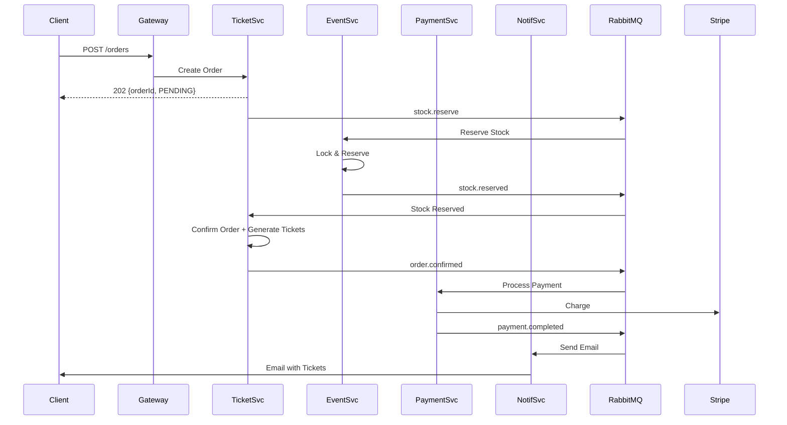

# E4 Backend - Plataforma de Venta de Tickets

Sistema de venta de tickets/entradas para eventos tipo Ticketmaster, construido con **microservicios** en **Java 21 + Spring Boot**.

## Arquitectura

### Microservicios

| Servicio | Puerto | Responsabilidad |
|----------|--------|-----------------|
| **api-gateway** | 8080 | Gateway centralizado con rate limiting, CORS y circuit breakers |
| **auth-service** | 8090 | Autenticación y emisión de JWT |
| **user-service** | 8081 | Gestión de perfiles de usuario |
| **event-service** | 8082 | Catálogo de eventos y gestión de stock de tickets |
| **ticket-service** | 8083 | Órdenes de compra y tickets físicos |
| **payment-service** | 8084 | Procesamiento de pagos con Stripe |
| **notification-service** | 8085 | Notificaciones por email |

### Infraestructura

- **PostgreSQL 16**: Base de datos por servicio (Database per Service pattern)
- **RabbitMQ 3**: Mensajería asíncrona para patrón Saga
- **Redis 7**: Cache para rate limiting en el API Gateway
- **Docker + Docker Compose**: Orquestación completa

### Patrón de Diseño

- **Clean Architecture / Hexagonal**: Cada servicio tiene capas `domain`, `application`, `infrastructure`
- **Domain-Driven Design (DDD)**: Aggregate roots, Value Objects, Rich Domain Models
- **Saga Coreografiado**: Flujo de compra distribuido con eventos en RabbitMQ
- **CQRS Light**: Separación de comandos y queries en aplicación

## Inicio Rápido

### Prerrequisitos

- Docker Desktop o Docker Engine + Docker Compose
- Java 21 JDK (para desarrollo local)
- Gradle 8.5+ (incluido wrapper)

### 1. Clonar el Repositorio

```bash
git clone <repository-url>
cd e4_backend
```

### 2. Configurar Variables de Entorno

```bash
# Copiar el archivo de ejemplo
cp .env.example .env

# Editar .env con tus valores
nano .env
```

**Mínimo requerido**:
```env
JWT_SECRET=your-secret-key-min-256-bits-for-hs256-algorithm-security
STRIPE_SECRET_KEY=sk_test_your_stripe_secret_key
```

### 3. Levantar Todos los Servicios

```bash
# Construir y levantar todo el stack
docker-compose up -d

# Ver logs
docker-compose logs -f

# Ver logs de un servicio específico
docker-compose logs -f api-gateway
```

### 4. Verificar Salud del Sistema

```bash
# API Gateway health
curl http://localhost:8080/actuator/health

# RabbitMQ Management UI
open http://localhost:15672
# Usuario: guest / Password: guest
```

## Uso del API Gateway

### Todos los servicios son accesibles a través del gateway en `http://localhost:8080`

### Ejemplo: Registro y Login

```bash
# 1. Registrar usuario
curl -X POST http://localhost:8080/api/v1/auth/register \
  -H "Content-Type: application/json" \
  -d '{
    "email": "usuario@example.com",
    "password": "password123",
    "firstName": "Juan",
    "lastName": "Pérez"
  }'

# 2. Login
curl -X POST http://localhost:8080/api/v1/auth/login \
  -H "Content-Type: application/json" \
  -d '{
    "email": "usuario@example.com",
    "password": "password123"
  }'

# Respuesta:
{
  "token": "eyJhbGciOiJIUzI1NiIsInR5cCI6IkpXVCJ9...",
  "userId": "123",
  "email": "usuario@example.com",
  "role": "USER"
}
```

### Ejemplo: Listar Eventos

```bash
# Eventos públicos (no requiere autenticación)
curl http://localhost:8080/api/v1/events

# Con paginación
curl "http://localhost:8080/api/v1/events?page=0&size=20"

# Filtrar por categoría
curl "http://localhost:8080/api/v1/events?categoryId=1"
```

### Ejemplo: Crear Orden de Compra

```bash
TOKEN="<tu-jwt-token>"

curl -X POST http://localhost:8080/api/v1/orders \
  -H "Authorization: Bearer $TOKEN" \
  -H "Content-Type: application/json" \
  -d '{
    "items": [
      {
        "eventId": "1",
        "ticketTypeId": "1",
        "quantity": 2
      }
    ]
  }'

# Respuesta:
{
  "orderId": "abc123",
  "status": "PENDING",
  "totalAmount": 0,
  "items": [...]
}

# La orden se procesará asíncronamente. Consultar estado:
curl http://localhost:8080/api/v1/orders/abc123 \
  -H "Authorization: Bearer $TOKEN"
```

## Flujo de Compra (Saga)



## Rate Limiting

El API Gateway implementa rate limiting inteligente:

| Tipo de Usuario | Requests/min | Endpoint |
|-----------------|--------------|----------|
| Anónimo (IP) | 100 | General |
| Autenticado | 200 | General |
| Order Creation | 10 | POST /orders |

Headers de respuesta:
```
X-RateLimit-Limit: 200
X-RateLimit-Remaining: 187
X-RateLimit-Reset: 1678901234
```

Si excedes el límite: **HTTP 429 Too Many Requests**

## Circuit Breakers

Cada servicio backend tiene un circuit breaker configurado. Si un servicio falla:

1. Después de **5 llamadas**, el gateway evalúa la tasa de fallos
2. Si **>50% fallan**, el circuit se abre (OPEN)
3. Requests retornan fallback inmediatamente
4. Después de **10 segundos**, intenta recuperación (HALF_OPEN)

Ver estado:
```bash
curl http://localhost:8080/actuator/circuitbreakers
```

## Desarrollo

### Estructura de un Servicio

```
service-name/
├── src/main/java/com/tickets/service_name/
│   ├── [bounded-context]/
│   │   ├── application/          # Use Cases
│   │   │   ├── CreateXUseCase.java
│   │   │   └── dto/
│   │   ├── domain/                # Domain Layer (PURE)
│   │   │   ├── Entity.java
│   │   │   ├── ValueObject.java
│   │   │   ├── Repository.java   # Interface
│   │   │   └── DomainService.java
│   │   └── infrastructure/        # Adapters
│   │       ├── persistence/       # JPA
│   │       ├── rest/              # Controllers
│   │       └── messaging/         # RabbitMQ
│   └── config/                    # Spring Config
└── src/main/resources/
    ├── application.properties
    └── db/migration/              # Flyway migrations
```

### Agregar un Nuevo Endpoint

1. **Domain**: Crear entidad y lógica de negocio
2. **Application**: Crear Use Case
3. **Infrastructure - REST**: Crear Controller + DTOs
4. **Infrastructure - Persistence**: Crear JPA Entity + Repository
5. **Migraciones**: Agregar Flyway SQL migration

### Ejecutar Tests

```bash
# Tests de un servicio específico
cd event-service
./gradlew test

# Tests de integración (requiere Testcontainers)
./gradlew integrationTest
```

## Base de Datos

Cada servicio tiene su propia base de datos PostgreSQL:

| Servicio | Database | Puerto Host |
|----------|----------|-------------|
| auth-service | auth_db | 5442 |
| user-service | user_db | 5443 |
| event-service | event_db | 5444 |
| ticket-service | ticket_db | 5447 |
| payment-service | payment_db | 5445 |
| notification-service | notification_db | 5446 |

### Conectar a una DB

```bash
psql -h localhost -p 5444 -U testuser -d event_db
# Password: testuser
```

### Migraciones con Flyway

Las migraciones se aplican automáticamente al iniciar cada servicio:

```
src/main/resources/db/migration/
├── V1__create_table_x.sql
├── V2__add_column_y.sql
└── V3__create_index_z.sql
```

## Monitoreo y Observabilidad

### Actuator Endpoints

Cada servicio expone `/actuator/*`:

```bash
# Health check
curl http://localhost:8082/actuator/health

# Métricas
curl http://localhost:8082/actuator/metrics

# Info
curl http://localhost:8082/actuator/info
```

### RabbitMQ Management

- UI: http://localhost:15672
- Usuario: `guest` / Password: `guest`
- Ver colas, exchanges, mensajes

### Logs

```bash
# Ver logs en tiempo real
docker-compose logs -f

# Logs de un servicio específico
docker-compose logs -f event-service

# Últimas 100 líneas
docker-compose logs --tail=100 ticket-service
```

## Detener y Limpiar

```bash
# Detener servicios
docker-compose down

# Detener y eliminar volúmenes (¡BORRA DATOS!)
docker-compose down -v

# Reconstruir servicios
docker-compose up -d --build
```

## Documentación API (Swagger)

Cada servicio expone documentación OpenAPI:

- **Auth**: http://localhost:8090/api/docs
- **User**: http://localhost:8081/api/docs
- **Event**: http://localhost:8082/api/docs
- **Ticket**: http://localhost:8083/api/docs
- **Payment**: http://localhost:8084/api/docs

**Nota**: En producción, accede a través del gateway en el puerto 8080.


## Contribuir

1. Fork el proyecto
2. Crea una rama feature (`git checkout -b feat/nueva-feature`)
3. Commit tus cambios (`git commit -m 'feat: Agregar nueva feature'`)
4. Push a la rama (`git push origin feat/nueva-feature`)
5. Abre un Pull Request


